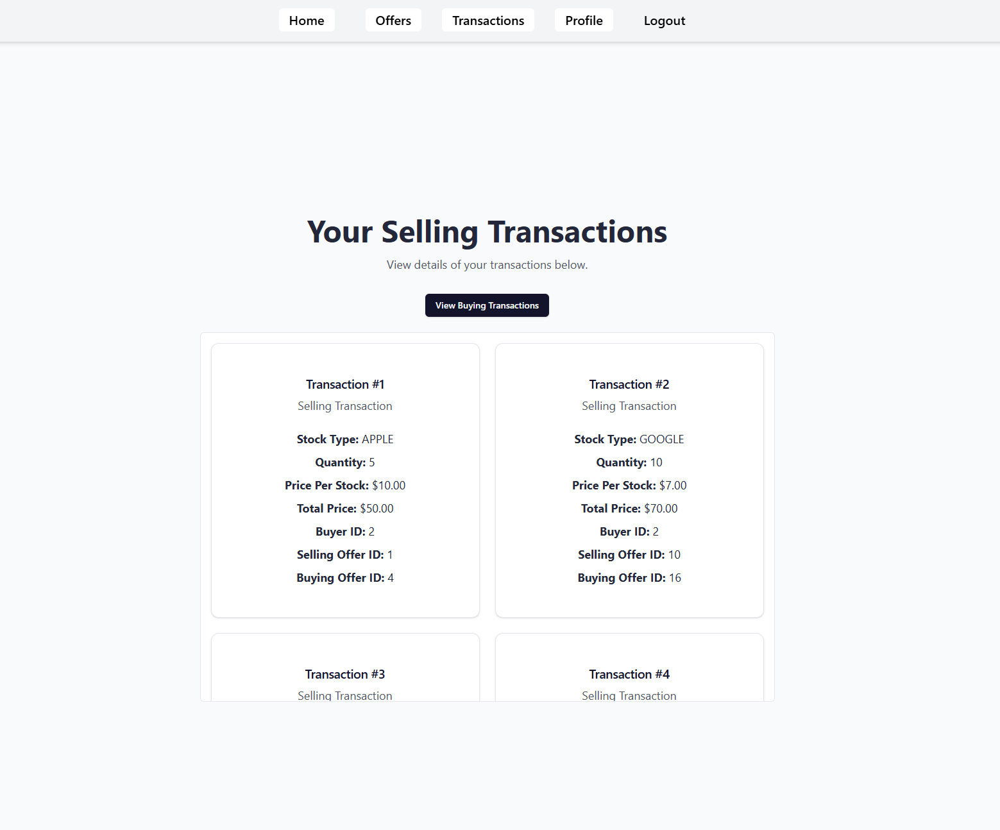

# Stock Exchange App

This project is a **Stock Exchange** fullstack application built with a **React.js frontend** and a **Spring Boot backend**. The application allows users to manage their stock and money wallets, create offers, view transactions, and update their profile.

---

## Features

### **Frontend**
- **Authentication**:
  - Login and registration functionality.
  - Protected routes for authenticated users.
- **User Dashboard**:
  - Create and manage stock offers.
  - View stock and money wallet details.
- **Offers Management**:
  - View pending, completed, and cancelled offers.
  - Cancel pending offers with a single click.
- **Transactions**:
  - View transaction history for buying and selling activities.
- **Dynamic UI**:
  - Responsive design using TailwindCSS.
  - Scrollable areas for content-heavy sections.

### **Backend**
- Built using **Spring Boot** with a RESTful API architecture.
- **Authentication**:
  - Secure login and registration endpoints.
  - JWT-based authentication for secure access.
- **Business Logic**:
  - Manage stock and money wallets, offers, and transactions.
- **Database**:
  - Relational database (PostgreSQL) for persisting user data, stock details, and transactions.
  - Hosted on [NeonDB](https://console.neon.tech/)
- **Validation**:
  - Robust input validation using Spring's annotation-based validators.

---

## Technologies Used

### Frontend
- **React.js**: Component-based development.
- **TailwindCSS**: Utility-first CSS framework for responsive design.
- **ShadCN Components**: Prebuilt, accessible UI components.
- **React Router**: For navigation and route management.
- **Axios**: For HTTP client requests.
- **React Hook Form + Zod**: Form handling with validation.

### Backend
- **Spring Boot**: Backend framework.
- **PostgreSQL**: Database for persisting user data, offers, and transactions.
- **Spring Security**: For authentication and authorization.
- **Spring Data JPA**: For database interactions.
- **Hibernate Validator**: For backend input validation.

---

## Installation and Setup

### Prerequisites
- **Frontend**:
  - Node.js (v16+ recommended)
  - npm or yarn
- **Backend**:
  - Java 17 or later
  - PostgreSQL
  - Maven


## Screenshots

<div align="center">

### Home Page


---

### Offers Page


---

### Transactions Page


---

### Profile Page


---

### Login Page


---

### Register Page


</div>


## Example API Endpoints

### **Authentication**
- **POST** `/clients/login`: Login a user.
- **POST** `/clients/register`: Register a new user.

### **Offers**
- **GET** `/offers/client/{id}`: Get offers for a specific client.
- **PUT** `/offers/{id}/cancel`: Cancel an offer.

### **Transactions**
- **GET** `/transactions/selling-client/{id}`: Get selling transactions for a client.
- **GET** `/transactions/buying-client/{id}`: Get buying transactions for a client.

### **Wallet**
- **GET** `/clients/{id}/money-wallet`: Get a client's money wallet.
- **PATCH** `/clients/{id}/money-wallet`: Update a client's money wallet.


## Contributing

1. Fork the repository.

2. Create a new branch:
    ```bash
    git checkout -b feature/your-feature-name
    ```
3. Commit your changes:
    ```bash
    git commit -m "Add new feature"
    ```
4. Push the branch:
    ```bash
    git push origin feature/your-feature-name
    ```
5. Open a pull request.


## License

This project is licensed under the **MIT License**. 

You are free to use, copy, modify, merge, publish, distribute, sublicense, and/or sell copies of the Software, subject to the following conditions:

- The above copyright notice and this permission notice must be included in all copies or substantial portions of the Software.
- The software is provided "as is", without warranty of any kind, express or implied, including but not limited to the warranties of merchantability, fitness for a particular purpose, and noninfringement.
